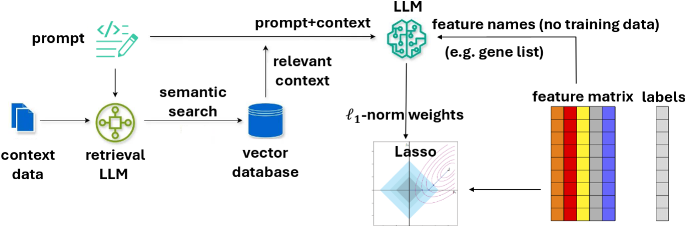

# LLM-Lasso
LLM-Lasso is a novel framework that leverages large language models (LLMs) to guide feature selection in Lasso $\ell_1$ regression.
Unlike traditional feature selection methods that rely solely on numerical data, LLM-Lasso incorporates domain-specific knowledge extracted from natural language, enhanced through an optional retrieval-augmented generation (RAG) pipeline, to seamlessly integrate data-driven modeling with contextual insights. Specifically, the LLM generates penalty factors for each feature, which are converted into weights for the Lasso penalty using a simple, tunable model. Features identified as more relevant by the LLM receive lower penalties, increasing their likelihood of being retained in the final model, while less relevant features are assigned higher penalties, reducing their influence. Importantly, LLM-Lasso has an internal validation step that determines how much to trust the contextual knowledge in our prediction pipeline.

🔗 Paper link: [LLM-Lasso: A Robust Framework for Domain-Informed Feature Selection and Regularization]{https://arxiv.org/abs/2502.10648}



## Setup Instructions
(_Note_: these are the same as the instructions in `llm_lasso_tutorial.ipynb`)

1. Install `LLM-Lasso` as an editable package:
    ```
    $ pip install -e .
    ```
    for `pip`, or
    ```
    $ conda develop .
    ```
    for `conda`. Note that this requires you to `conda install conda-build`.

2. Initialize the `adelie` submodule:
    ```
    $ git submodule init
    $ git submodule update
    ```
3. Install `adelie` as an editable package (`adelie` is used for solving LASSO with penalty factors).
    ```
    $ cd adelie-fork
    $ pip install -e .
    ```
    or the equivalent for `conda`.

4. Copy the file `sample_constants.py` to `_my_constants.py` and populate relevant API keys.

The values from `_my_constants.py` are automatically loaded into `constants.py`.

### Common Setup Issues
Installing `adelie` as an editable package requires compiling from source, which may come with several issues:
- `adelie` requires some C++ libraries, namely `eigen`, `llvm`, and `openmp` (which may be installed as `libomp`). For Unix-based systems, these should be available through your package manager, and releases are also available online.
- There may issues with the `eigen` library (and others) not being in the `C_INCLUDE_PATH` and `CPLUS_INCLUDE_PATH`. For this, you need to:
    - Find where the `eigen` include directory is on your machine (it should be a directory with subdirectories `Eigen` and `unsupported`). For macOS with `eigen` installed via `homebrew`, this may be in a directory that looks like `/opt/homebrew/Cellar/eigen/3.4.0_1/include/eigen3/`. For linux, this may be `/usr/include/eigen3/` or `/usr/local/include/eigen3/`, for instance.

    - Run the following:
        ```
        $ export C_INCLUDE_PATH="the_path_from_the_previous_step:$C_INCLUDE_PATH"
        $ export CPLUS_INCLUDE_PATH="the_path_from_the_previous_step:$CPLUS_INCLUDE_PATH"
        ```
    You may also have to do this with other libraries, like `libomp`.

- If you installed `llvm` via `homebrew` on macOS, make sure you run the following:
    ```
    $ export LDFLAGS="-L/opt/homebrew/opt/llvm/lib"
    $ export CPPFLAGS="-I/opt/homebrew/opt/llvm/include"
    ```

## Tutorials
For a tutorial on the full LLM-Lasso pipeline, see `examples/llm_lasso_tutorial.ipynb`, which walks through the LLM-Lasso process for two of the small-scale datasets (one classification problem and one regression problem).

For a tutorial on scraping the OMIM database and using the resulting documents for retrieval augmented generation (RAG), see `examples/omim_rag_tutorial.ipynb`.

## Repo Structure

- **`adelie-fork`**: `adelie` submodule, which is used for solving the penalty factor formation of Lasso.
- **`examples`**: tutorials for LLM-Lasso and the OMIM RAG pipeline.
- **`omim_scrape`**: helper fuctions for OMIM RAG.
- **`playground`**: some interactive scripts for querying LLMs, with or without RAG.
- **`prompts`**: prompts used for LLM-Lasso, the LLM-Score baseline, and vector store retrieval.
- **`scripts`**: `python` scripts for the LLM-Lasso pipeline (generating data splits and getting LLM-Lasso penalties) and running the baselines.

    The primary scripts are as follows:   
    - **`small_scale_splits.py`**: generates random training and test splits for the small-scale datasets.
    Test error and AUROC results downstream are taken as averages over these splits.
    - **`run_baselines.py`**: runs the data-driven baseline methods on train/test splits generated, e.g., by `small_scale_splits.py`.
    - **`llm_score.py`**: generates importance scores via the LLM-Score baseline.
    - **`llm_lasso_scores.py`** generates LLM-Lasso penalty factors.
    
    The following scripts may also be useful:
    - **`adversarial_feature_names.py`**: generates an adversarially-corrupted feature name list.
    - **`pubmed_retrieve.py`**: prints out the information retrieved for a given gene through the Pubmed RAG pipeline.
- **`src/llm_lasso`**: primary code for the `llm_lasso` package.
    - **`adversarial`**: adversarial feature name corruption.
    - **`baselines`**: data-driven baseline and LLM-Score implemetation.
    - **`llm_penalty`**: generation of LLM-Lasso penalty factors, with and without RAG.
    - **`task_specific_lasso`**: running LASSO with LLM-generated penalty factors and plotting results.
    - **`data_splits.py`**: generation of random training and test splits, which are used for both the baselines and LLM-Lasso.
    - **`utils`**: helper functions.
- **`constants.py`**, **`sample_constants.py`**: files for storing API keys, etc.
